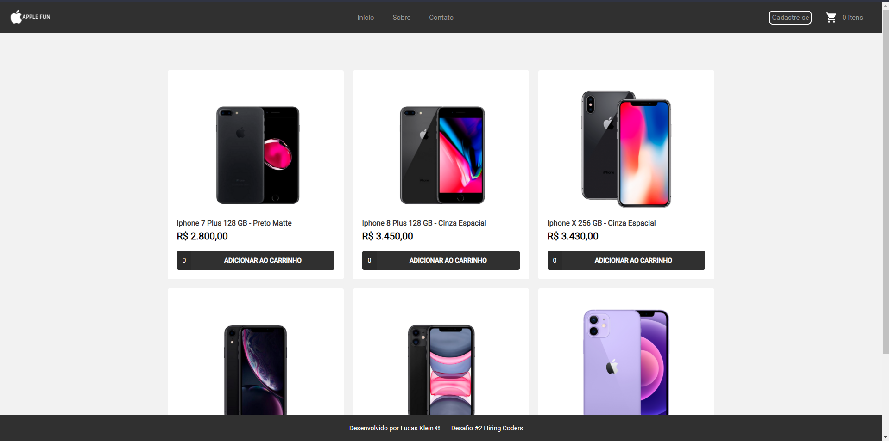
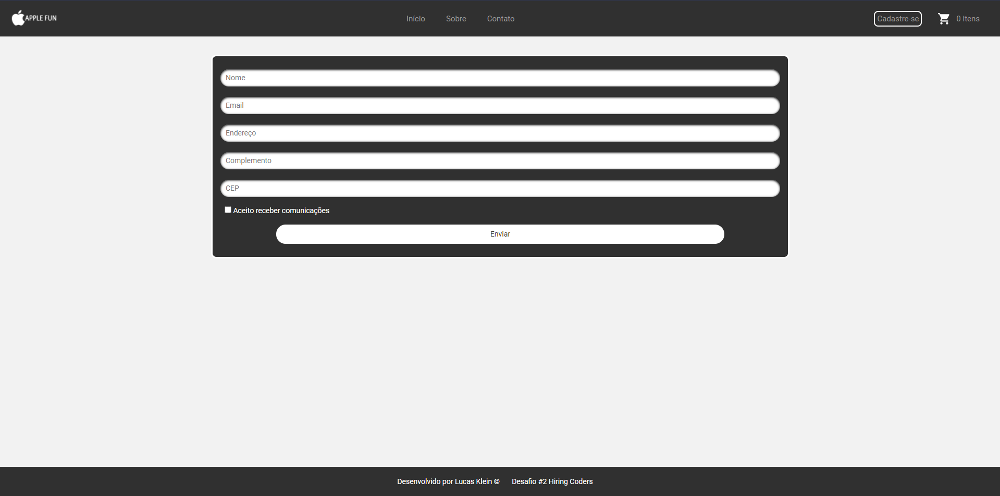
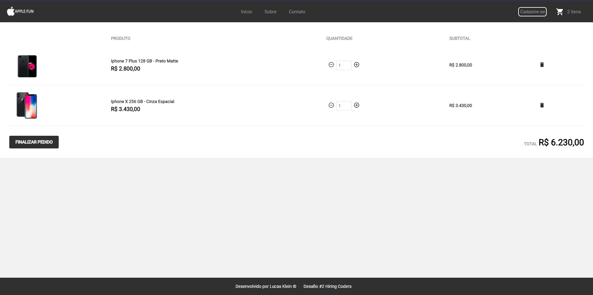

<h1 align="center"> Apple-Fun/h1>

Projeto desenvolvido durante o Hiring coders da VTEX com Gama Academy

Preview: hhttps://apple-fun.netlify.app//

📖 - Projeto para o Desafio 2 do #hiringcoders, com o intúito de desenvolver um sistema de E-commerce, que guarde dados de clientes, endereços, produtos, devidamente
estruturados no localstorage. Para este projeto, foi desenvolvido uma loja de fã da Apple, que possui sistema de cadastro e de carrinho com os produtos que estão cadastrados.

<h2>🚀 Tecnologias utilizadas: </h2>

- HTML
- CSS
- TypeScript
- React
- Styled Components
- API-Fake

<h2>Para iniciar o projeto use: </h2>
git clone https://github.com/olucasklein/gama-apple-fun.git

<h2>Para iniciar a aplicação:/h2>
Instale os pacotes com npm i
Inicie o server com npm run server
Rode a aplicação com npm run start

<h2>📝 Licença</h2>
Esse projeto está sob a licença MIT. Veja o arquivo LICENSE para mais detalhes.
